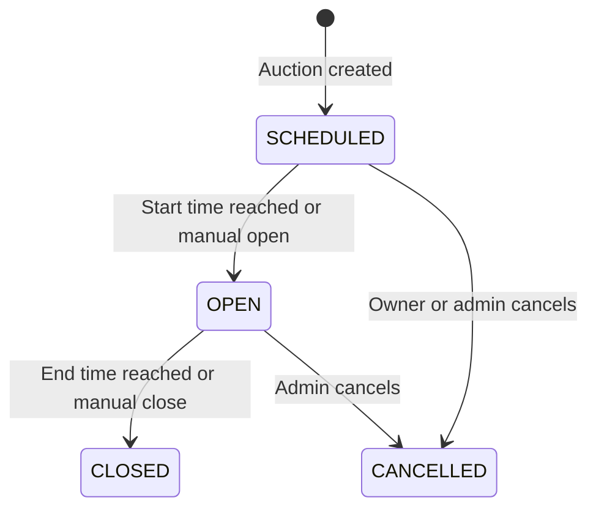

## Project Overview

It allows users to create auctions, place bids, track their activity, and determine winners automatically. It also gives administrators tools to manage users, oversee auctions, and review a complete audit trail.

The system supports both public browsing and protected operations through JWT authentication.

---

## Main Capabilities

- User registration and login with JWT authentication.
- Secure BCrypt password hashing.
- User and administrator roles.
- Public auction browsing, filtering, searching, sorting, and pagination.
- English auctions with visible competitive bidding.
- Sealed-bid auctions with private bids until closing.
- Automatic auction opening and closing based on time.
- Manual open, close, and cancellation operations.
- Automatic winner determination.
- Concurrency-safe bidding using a database row lock.
- Personal views for created auctions, placed bids, and won auctions.
- Administrator user management and platform-wide auction search.
- Complete audit logging for important actions.
- Consistent JSON error responses and request validation.
- Swagger/OpenAPI documentation.
- Oracle database support through Docker.

---

## Auction Formats

### English Auction

- Everyone can see the bidding history and current highest bid.
- The first bid must be at least the starting price.
- Every later bid must beat the current highest bid by the minimum increment.
- A bidder may place multiple bids.
- The highest bid wins.

### Sealed-Bid Auction

- Each user may submit only one final bid.
- Bidders cannot see other users' bids before the auction closes.
- A logged-in bidder may view only their own bid while the auction is still active.
- After a successful close, all bids are revealed.
- The highest bid wins.
- If two bids have the same amount, the earliest bid wins.
- A cancelled sealed auction remains private.

---

## Auction Lifecycle



### Lifecycle Rules

- New auctions begin as `SCHEDULED`.
- Only scheduled auctions can be edited.
- Auctions can be opened manually by the owner or an administrator.
- The scheduler automatically opens auctions when their start time arrives.
- Open auctions can be closed manually by the owner or an administrator.
- The scheduler automatically closes auctions after their end time.
- A scheduled auction can be cancelled by its owner or an administrator.
- Only an administrator can cancel an already open auction.
- `CLOSED` and `CANCELLED` are terminal states.
- Clients cannot directly assign an auction status.

---

## Automatic Winner Selection

When an auction closes, BidForge:

1. Finds the highest bid.
2. Uses the earliest bid as the winner when amounts are tied.
3. Creates an immutable auction-result record.
4. Records the winner, winning bid, final price, and closing time.
5. Creates a result even if the auction received no bids.

The close operation, result creation, and audit records are completed in one transaction.

---

## Scheduler

A background scheduler runs approximately every ten seconds.

It:

- Finds `SCHEDULED` auctions whose start time has arrived and opens them.
- Finds `OPEN` auctions whose end time has passed and closes them.
- Uses the same service logic as manual open and close operations.
- Processes each auction independently so one failure does not stop the entire scheduler run.
- Records automatic actions under the actor name `SYSTEM`.

---

## Concurrency Protection

BidForge protects state-changing auction operations with a pessimistic database row lock.

This is especially important when two bids arrive at nearly the same time:

- The first transaction locks the auction row.
- The second transaction waits.
- The first bid is validated and committed.
- The second bid then sees the updated highest bid and is revalidated correctly.

This prevents duplicate closing, stale bid validation, and corrupted auction state.

---

## User Capabilities

An authenticated user can:

- View their own profile.
- Create an auction.
- Browse and search auctions.
- View auction details.
- View their own created auctions.
- View auctions they have won.
- Edit their own scheduled auction.
- Open or close their own auction when its state allows it.
- Cancel their own scheduled auction.
- Bid on another user's open auction.
- View their own bid history.
- View public English-auction bids.
- View only their own sealed bid before closing.

A seller cannot bid on their own auction.

---

## Administrator Capabilities

An administrator can:

- Perform normal authenticated-user operations.
- List all user accounts.
- Enable or disable another user.
- Search auctions across the entire platform.
- Filter auctions by seller username.
- Open or close any auction when the state allows it.
- Cancel scheduled or open auctions.
- Read and filter the audit trail.

Important restrictions:

- An administrator cannot disable their own account.
- Administrator status does not automatically allow editing another seller's auction.
- Administrators must still follow normal auction-state and bidding rules.

---

## Public Capabilities

A visitor without an account can:

- Register.
- Log in.
- Browse, filter, search, sort, and paginate auctions.
- View auction details.
- View English-auction bid history.
- View all sealed bids after the auction closes.
- Access Swagger/OpenAPI documentation.

Protected operations require a valid JWT belonging to an enabled account.

---

# API Endpoints

## Authentication and Profile

| Method | Endpoint | Access | Purpose |
|---|---|---|---|
| `POST` | `/api/auth/register` | Public | Register a normal user account. |
| `POST` | `/api/auth/login` | Public | Authenticate and receive a JWT. |
| `GET` | `/api/users/me` | Authenticated | View the logged-in user's profile. |

## Auctions

| Method | Endpoint | Access | Purpose |
|---|---|---|---|
| `POST` | `/api/auctions` | Authenticated | Create a scheduled auction. |
| `GET` | `/api/auctions` | Public | Browse and search auctions. |
| `GET` | `/api/auctions/mine` | Authenticated | View auctions created by the logged-in user. |
| `GET` | `/api/auctions/won` | Authenticated | View auctions won by the logged-in user. |
| `GET` | `/api/auctions/{id}` | Public | View full auction details and result when closed. |
| `PUT` | `/api/auctions/{id}` | Owner | Edit a scheduled auction. |
| `POST` | `/api/auctions/{id}/open` | Owner or admin | Open a scheduled auction. |
| `POST` | `/api/auctions/{id}/close` | Owner or admin | Close an open auction and determine the winner. |
| `POST` | `/api/auctions/{id}/cancel` | Owner or admin | Cancel an auction according to state rules. |

### Auction Search Parameters

`GET /api/auctions` supports:

- `status`
- `type`
- `category`
- `q` for title search
- `page`
- `size`
- `sort`

Example:

```http
GET /api/auctions?status=OPEN&type=ENGLISH&category=ART&q=painting&page=0&size=20&sort=endTime,asc
```

## Bids

| Method | Endpoint | Access | Purpose |
|---|---|---|---|
| `POST` | `/api/auctions/{auctionId}/bids` | Authenticated | Place a bid. |
| `GET` | `/api/auctions/{auctionId}/bids` | Public with visibility rules | View auction bids. |
| `GET` | `/api/bids/my` | Authenticated | View bids placed by the logged-in user. |

### Bid Visibility

| Situation | Anonymous Visitor | Logged-In User |
|---|---|---|
| English auction | All bids | All bids |
| Active sealed auction | No bids | Only their own bid |
| Closed sealed auction | All bids | All bids |
| Cancelled sealed auction | No bids | Only their own bid |

## Administration

| Method | Endpoint | Access | Purpose |
|---|---|---|---|
| `GET` | `/api/admin/users` | Admin | List all users. |
| `PATCH` | `/api/admin/users/{id}/status` | Admin | Enable or disable a user. |
| `GET` | `/api/admin/auctions` | Admin | Search all auctions, including by seller. |
| `GET` | `/api/admin/audit-events` | Admin | Read and filter the audit trail. |

## API Documentation

| Method | Endpoint | Access | Purpose |
|---|---|---|---|
| `GET` | `/swagger-ui.html` | Public | Open Swagger UI. |
| `GET` | `/swagger-ui/**` | Public | Swagger UI resources. |
| `GET` | `/v3/api-docs/**` | Public | OpenAPI specification. |

---

## Validation and Error Handling

BidForge validates requests at multiple levels:

- DTO validation for required fields, formats, positive amounts, and future times.
- Service validation for auction-state and bidding rules.
- Database constraints for uniqueness, relationships, and required values.

Every error follows one consistent JSON structure containing:

- Timestamp
- HTTP status
- Error code
- Human-readable message
- Request path
- Optional field-validation errors

---

## Audit Trail

Important activity is recorded in an insert-only audit log, including:

- User registration.
- User enable/disable changes.
- Auction creation and editing.
- Auction opening, closing, and cancellation.
- Bid placement.
- Winner selection.
- Scheduler actions performed by `SYSTEM`.

Administrators can filter the audit trail by actor, entity type, and entity ID.

---

## Data and API Design

- Entities represent Oracle database tables.
- DTOs define the public request and response formats.
- Entities are never returned directly from the API.
- Mappers convert entities into safe DTO responses.
- Monetary values use `BigDecimal` for exact calculations.
- Timestamps use UTC `Instant` values.
- Lazy database relationships avoid unnecessary data loading.

---

